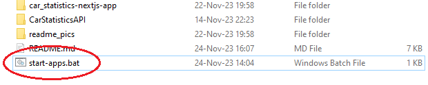
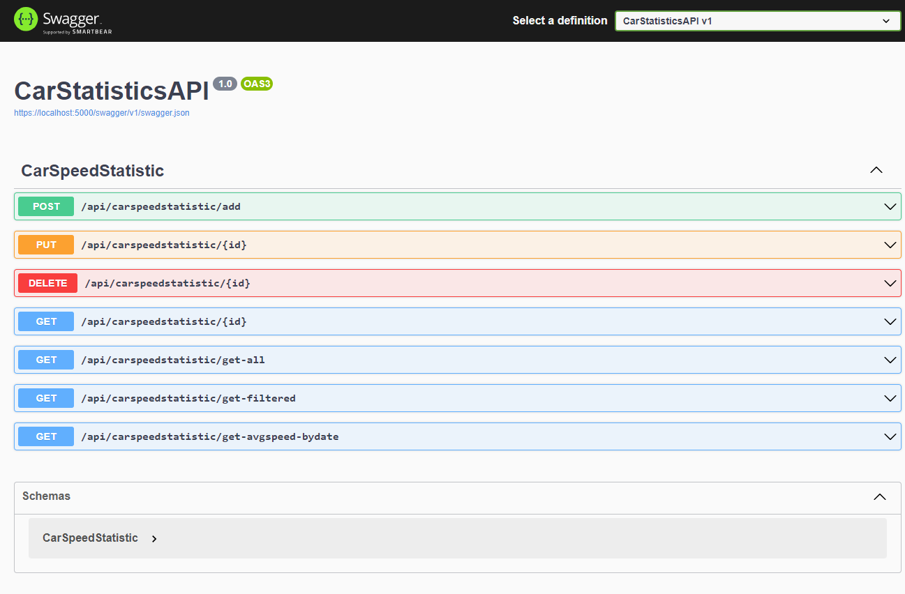
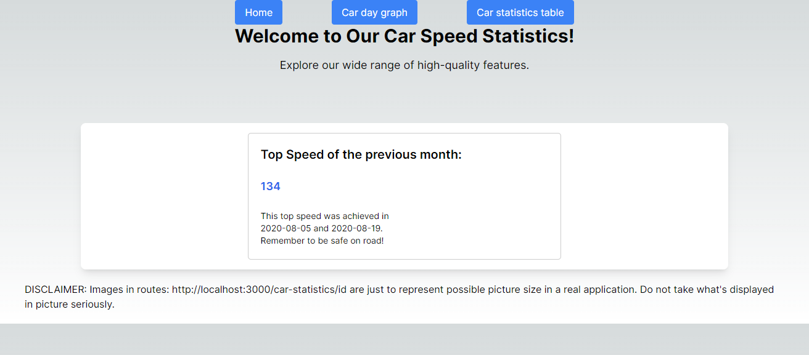
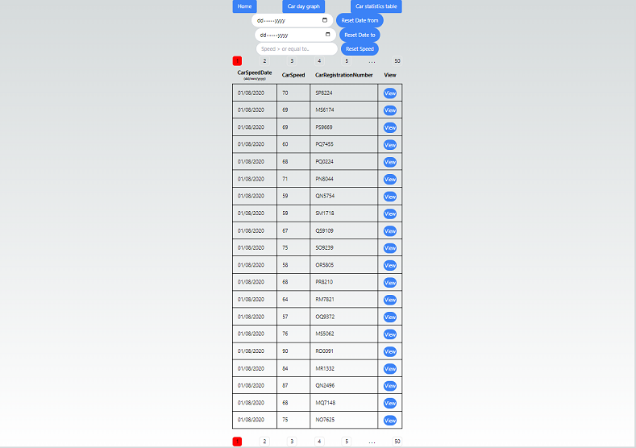
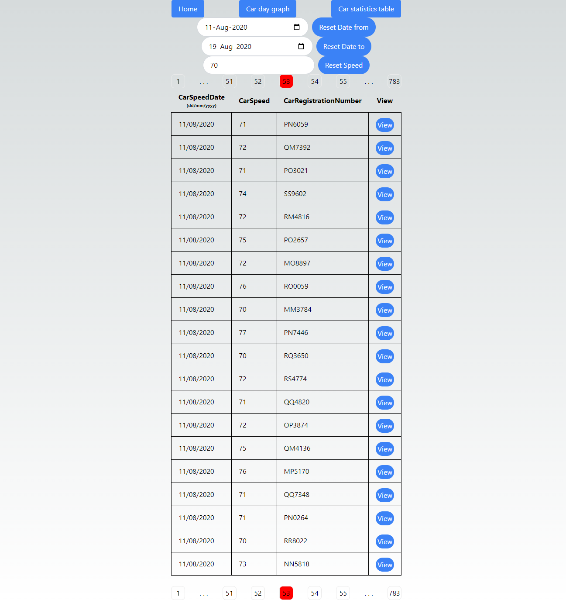
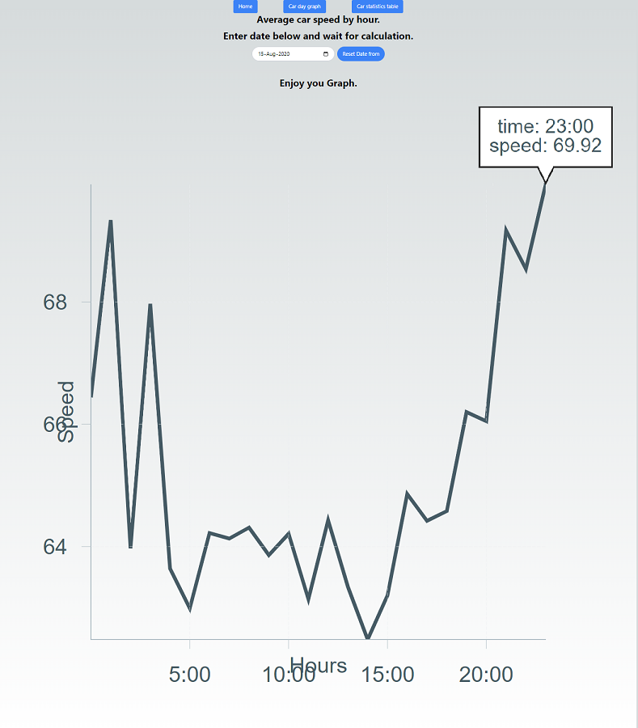
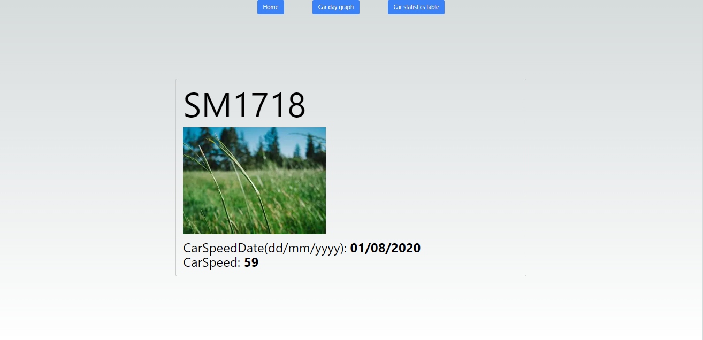
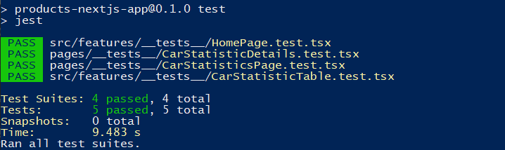

### Name Lastname

Kristaps Mītins

### How to run project

### :exclamation::exclamation::exclamation: Download and install :exclamation::exclamation::exclamation:

Node Js Latest LTS Version<br>
https://nodejs.org/en/download/

Visual Studio (If you lost data in CarStatisticsSQLite.db or want to load new/additionl data.)<br/>
https://visualstudio.microsoft.com/free-developer-offers/

.NET 6.0 <br>
https://dotnet.microsoft.com/en-us/download

1. Download all files and folders inside 'CarStatistics'.

   - CarStatistics
     - car_statistics-nextjs-app
     - CarStatisticsAPI
     - README.md
     - start-apps.bat

2. Launch ASP.NET web API and NextJS project.

   - 4.1 If you are on Windows OS - Double click 'start-apps.bat' file in root directory.
   - 
   - This should open 2 Command Prompts and default Web Browser.
   - :exclamation: Wait until all is loaded and start using http://localhost:3000

   OR

   - 4.2 Launch using cmd or powershell.

     - 4.1.1 Go to CarStatistics/CarStatisticsAPI/CarStatisticsAPI directory
     - 4.1.2 Open CMD (Command prompt) or powershell there and type 'dotnet run'

     OR

   - 4.3 Launch using 'Visual Studio'
     - 4.2.1 Set as start-up project 'CarStatisticsAPI' and launch project.
   - 4.4 Launch NextJS application.
     - 4.3.1 Go to 'CarStatistics/car_statistics-nextjs-app' open 'cmd' or powershell.
     - 4.3.2 Type 'npm run dev'

3. Go to Web Browser.

   - Go to https://localhost:5000/swagger/index.html for 'Swagger UI'
   - Go to http://localhost:3000 for NextJS frontend. This is simple homepage.
   - Go to http://localhost:3000/car-statistics for 'CarStatistics' table.
     - Click on 'View' to go to 'CarStatisticDetails'
     - Go to http://localhost:3000/car-statistics/{exisitngId} for 'CarStatisticDetails'.
   - Go to http://localhost:3000/car-graph for 'CarStatistics' avg speed graph.

4. Use functionality.

   - car-statistics
     - Inside http://localhost:3000/car-statistics.
     - If no filters are entered it returns the first 1000 'CarStatistics'.
     - Enter 'Date from' or 'Date to' or 'Speed' or None to filter 'CarStatistics'.
       - Remember we inserted 'CarStatistics' with dates from 01-08-2020 to 31-08-2020.
     - If you enter 'Date from' = '01-08-2020' it will returns over 200'000.
   - car-graph
     - Inside http://localhost:3000/car-graph.
     - Enter 'Date' to see average speed that day by hours.
       - Remember data contains 'CarStatistics' with dates from 01-08-2020 to 31-08-2020.

5. :exclamation: Use this step if data is lost or want to add new or additional data. In 'Visual Studio' open 'CarStatisticsDataLoaderIntoSystem'.

   - 3.1 Set as start up project 'CarStatisticsDataLoaderIntoSystem'
   - 
   - 3.2 By default it will use 'speed.txt' `string THE_FILE_NAME = "speed.txt";`
     - For testing you can use 'data_test.txt'
       - If you want to delete test files from database you can use query `DELETE FROM CarSpeedStatistics` (or similar depending on your naming)
   - 3.3 Set `addDataToSQLDatabase` to `true`! (`bool addDataToSQLDatabase = true;`)
   - 3.4 Launch the 'CarStatisticsDataLoaderIntoSystem' console application.
     - At the end it should print 'End connection'.
     - You can look inside 'CarStatisticsSQLite.db' using 'DB Browser (SQLite)'
     - 
   - :exclamation: If you want to add aditional data to existing one.

     - Change Id starting value in `CarStatisticsAPI\CarStatisticsDataLoaderIntoSystem\Program.cs`
     - Now there are 220308 rows inside database.
     - Change from:

     ```
         for (int i = 0; i < dataListLength; i++)
           {
               var cDate = carSpeedDataList[i].CarSpeedDate;
               var cSpeed = carSpeedDataList[i].CarSpeed;
               var cRegNr = carSpeedDataList[i].CarRegistrationNumber;
               theTable.Rows.Add(new object[] { i + 1, cDate, cSpeed, cRegNr });
           }
     ```

     - :exclamation: Change to (depending or your database row count):

     ```
         for (int i = 220308; i < dataListLength + 220308; i++)
           {
               var cDate = carSpeedDataList[i].CarSpeedDate;
               var cSpeed = carSpeedDataList[i].CarSpeed;
               var cRegNr = carSpeedDataList[i].CarRegistrationNumber;
               theTable.Rows.Add(new object[] { i + 1, cDate, cSpeed, cRegNr });
           }
     ```

### Problems

- A large amount of data. I have never worked before with a database that has over 200'000 rows. The challenge was to insert all rows in the SQL database quickly.
- The challenge was to display data in the frontend. At the beginning I inserted test data (100) rows, and added simple pagination. It worked until I inserted all 200'000+ rows. Simple pagination did not work because it displayed pagination numbers from 1 to data 'row count / page size' (220'000 / 20). After searching the internet and adding modifications to my Pagination I fixed this issue. Now it is a beautiful pagination with few buttons.
- The Challenge to display a graph and inform users about when data is loaded correctly. When a date is entered frontend displays a graph with calculations at different times. That could be confusing to a user. For now, I added 3.5 second delay to the `dateChanged` constant to indicate loading longer.
- Then changeed backend api/carspeedstatistic/get-avgspeed-bydate return type that also includes searched date. And in frontend and if date from user input maches with date from api, then text about "Calculation avg speed" disappears.

### Improvements

- Make app mobile friendly.
- Modify app so that it returns page by page.

  - Change http://localhost:3000/car-statistics to something like http://localhost:3000/car-statistics?page=5
    Modify backend link from https://localhost:5000/api/carspeedstatistic/get-filtered?speed=100&dateFrom=2020-08-20&dateUntil=2020-08-21 to someghing like https://localhost:5000/api/carspeedstatistic/get-filtered?speed=100&dateFrom=2020-08-20&dateUntil=2020-08-21&page=1

  - Modify return type from:

  ```
    [CarStatistics[]]
  ```

  to something like:

  ```
    {
      info: {returnSize: 1000, pagesCount: 50}
      results:CarStatistics[]
    }
  ```

- Inside http://localhost:3000/car-graph let user pick graph type. Now it is very close up graph.

### Pictures from project

https://localhost:5000/swagger/index.html


http://localhost:3000


http://localhost:3000/car-statistics


http://localhost:3000/car-statistics with filter<br/>
backend search: get-filtered?speed=70&dateFrom=2020-08-11&dateUntil=2020-08-19


http://localhost:3000/car-graph


http://localhost:3000/car-statistics/{id}


CarStatistics/car_statistics-nextjs-app -> powershell -> 'npm run test'

