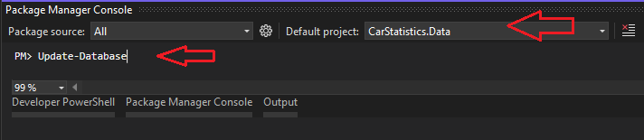
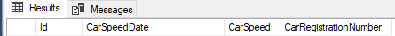
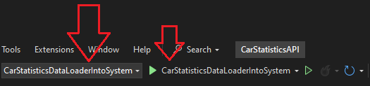
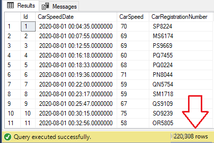

### Name Lastname

Kristaps Mītins

### How to run project

1. Download all files and folder inside 'CarStatistics'.

   - CarStatistics
     - car_statistics-nextjs-app
     - CarStatisticsAPI
     - README.md

2. Inside '/CarStatistics/CarStatisticsAPI' open CarStatisticsAPI.sln file using 'Visual Studio'.

   - 2.1 Inside 'Visual Studio' open 'Package Manager Console' set Default project to 'CarStatistics.Data'.
   - 2.2 Migrations is already set so type 'Update-Database'.
   - 
   - 2.3 This will create database in sql server named 'CarStatistics' and table 'CarSpeedStatistics'.
   - You can open 'Microsoft SQL Server Management Studio' and take a look.
   - 

3. To add data in database. In 'Visual Studio' open 'CarStatisticsDataLoaderIntoSystem'.

   - 3.1 Set as start up project 'CarStatisticsDataLoaderIntoSystem'
   - 
   - 3.2 By default it will use 'speed.txt' `string THE_FILE_NAME = "speed.txt";`
     - For testing you can use 'data_test.txt'
       - If you want to delete test files from database you can use query `DELETE FROM [CarStatistics].[dbo].[CarSpeedStatistics]` (or similar depending on your naming)
       - If you aslo want to reset tables ID's use `TRUNCATE TABLE [CarStatistics].[dbo].[CarSpeedStatistics]`
   - 3.3 Set `addDataToSQLDatabase` to `true`! (`bool addDataToSQLDatabase = true;`)
   - 3.4 Launch 'CarStatisticsDataLoaderIntoSystem' console application.
     - At end it should print 'End connection'.
     - You can look inside 'Microsoft SQL Server Management Studio'
     - 

4. Launch ASP.NET web API and NextJS project.

   - 4.1 Launch using cmd or powershell.

     - 4.1.1 Go to CarStatistics/CarStatisticsAPI/CarStatisticsAPI directory
     - 4.1.2 Open CMD (Command prompt) or powershell there and type 'dotnet run'

     OR

   - 4.2 Launch using 'Visual studio'
     - 4.2.1 Set as start up project 'CarStatisticsAPI' and launch project.
   - 4.3 Launch NextJS application.
     - 4.3.1 Go to 'CarStatistics/car_statistics-nextjs-app' open 'cmd' or powershell.
     - 4.3.2 Type 'npm run dev'

5. Go to Web Broswer.

   - Go to https://localhost:5000/swagger/index.html for 'Swagger UI'
   - Go to http://localhost:3000 for NextJS frontend. This is simple homepage.
   - Go to http://localhost:3000/car-statistics for 'CarStatistics' table.
     - Click on 'View' to go 'CarStatisticDetails'
     - Go to http://localhost:3000/car-statistics/100 for 'CarStatisticDetails'.
   - Go to http://localhost:3000/car-graph for 'CarStatistics' avg speed graph.

6. Use functionality.
   - car-statistics
     - Inside http://localhost:3000/car-statistics.
     - If no filters are entered it returns first 1000 'CarStatistics'.
     - Enter 'Date from' or 'Date to' or 'Speed' or None to filter 'CarStatistics'.
       - Remember we inserted 'CarStatistics' with dates from 01-08-2020 to 31-08-2020.
     - If you enter 'Date from' = '01-08-2020' it will returns over 200'000.
   - car-graph
     - Inside http://localhost:3000/car-graph.
     - Enter 'Date' to see average speed that day by hours.
       - Remember we inserted 'CarStatistics' with dates from 01-08-2020 to 31-08-2020.

### Problems

Large amount of data. I have never worked before with database that has over 200'000 rows.
Challenge was to insert all rows in sql database in quickly.
Challenge was to display data in frontend. At begining I inserted test data (100) rows. Added simple pagination.
It worked untill in inserted all 200'000+ rows. Simple pagination did not work because it displayed pagination numbers from 1 to data 'row count / page size' (220'000 / 20). After searching the internet and adding modifications to my Pagination I fixed this issue. Now it is beautiful pagination with few buttons.
Challenge to display graph and inform user about when data is loaded correctly. When date is entered frontend displays graph with calculations in different times. That could be confusing to user. For now I added 3.5 second delay to `dateChanged` constant to indicate loading longer.

### Improvements

Change http://localhost:3000/car-statistics to something like http://localhost:3000/car-statistics?page=5
Modify backend link from https://localhost:5000/api/carspeedstatistic/get-filtered?speed=100&dateFrom=2020-08-20&dateUntil=2020-08-21 to someghing like https://localhost:5000/api/carspeedstatistic/get-filtered?speed=100&dateFrom=2020-08-20&dateUntil=2020-08-21&page=1

Modify return type from:

```
  [CarStatistics[]]
```

to something like:

```
  {
    info: {returnSize: 1000, pagesCount: 50}
    results:CarStatistics[]
  }
```

When returning calculated average speed results include the date. For, example:

Change return type from `[{'hour':0, 'speed': 55,33}]` to `{'searchDate': '2020-08-14', 'result': [{'hour':0, 'speed': 55.33}]}`

Inside http://localhost:3000/car-graph let user pick graph type. Now it is very close up graph.
